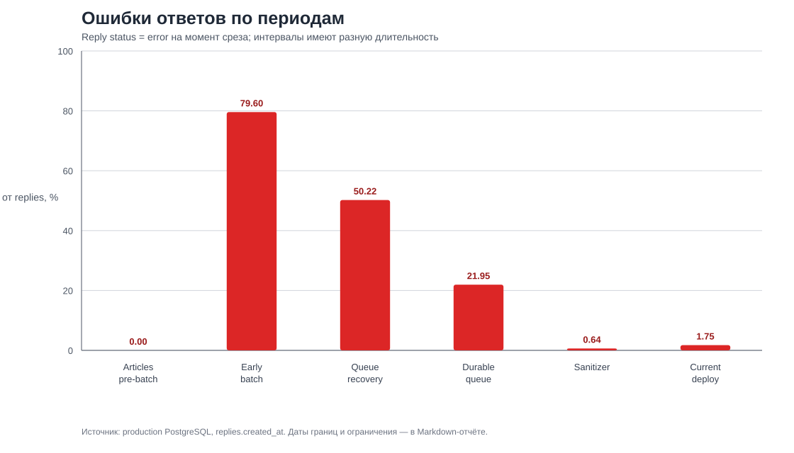
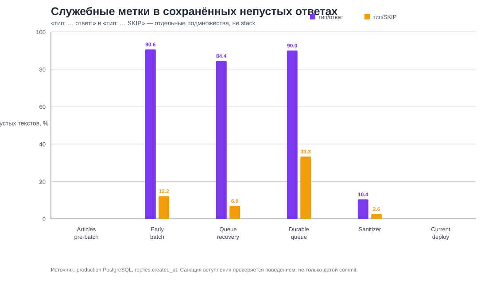
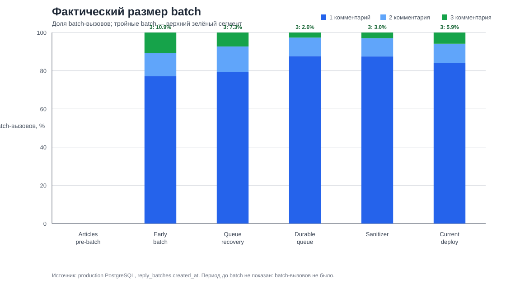

# Исторический анализ стабильности Dzen Commenter

Срез: 2026-09-17. Production, БД, конфигурация, контейнеры и Git history не изменялись. Дзен не открывался. Все production-числа получены read-only запросами; [точные запросы и команды](../docs/research/stability-history-analysis-sql.md) приложены отдельно.

## Вывод

1. Наиболее вероятная причина прошлой массовой утечки `тип: … ответ:` — не генерация именно трёх ответов. До `8dc494c` source prompt одновременно требовал транспортный формат `Cnn | текст` и в карточках требовал поля `тип:`/`ответ:`. В production до sanitation эти метки были в 84,42–90,61% непустых ответов; после — 10,43%, затем 0%.
2. Тройные batch действительно редки: 2,65–10,88% batch-вызовов по пяти post-batch интервалам. Но batch из двух также даёт потенциальную экономию запросов. Верхняя граница экономии LLM-вызовов — 13,0–25,2% от вызовов «один комментарий = один запрос»; фактическую token-экономию измерить нельзя: у всех 2 073 `reply_batches` поля `prompt_tokens` и `completion_tokens` пусты.
3. Лучший наблюдаемый post-batch интервал — после commit sanitation `8dc494c` и до старта current container: 2 reply-error из 313 созданных ответов (0,64%), 0 terminal publication-error, 3 marker `тип/SKIP` из 115 непустых текстов (2,61%). Длительность всего 61,39 ч., поэтому это сильный сигнал, но не долгосрочное доказательство.
4. Запрошенная версия «очищенные статьи, без batch» точно определяется в Git как `5eab5ff` (2026-08-24 22:16:29 +03), parent `6a2bb885`. В наблюдаемом 140,51-часовом окне до первого production batch было 0 reply-error из 761 созданного ответа и 0 служебных меток. Но этот период нельзя честно назвать абсолютным победителем: durable publication queue тогда ещё не существовала, а deployment `5eab5ff` серверным журналом не подтверждён.
5. Поэтому данные не оправдывают автоматический полный rollback. Они оправдывают выбор `5eab5ff` как **контрольного pre-batch baseline** и отдельное решение о batch после инструментирования токенов и накопления более длинного post-sanitizer периода. Ни tag, ни ветка, ни откат в этом исследовании не созданы.

## Источники и границы доказательств

Проверено 171 commit во всех доступных локальных refs. В milestone включались только изменения runtime-пути `fetch → eligibility → generation → parse/validation → persistence → publication`, settings/очередей и миграций, которые меняют этот путь. Исключены самостоятельные docs, tests, admin/UI и инфраструктурные изменения без влияния на этот путь.

Production DB имеет 8 256 comments, 5 758 replies, 2 073 reply_batches. PostgreSQL — `Etc/UTC`. `comments.fetched_at` стал first-seen timestamp только после `590eded` 2026-07-31; ранний июль по нему несопоставим. `comments.status` и `replies.status` — текущие mutable состояния, а не неизменяемый журнал попыток.

Production Git reflog даёт evidence pull с 2026-08-30, а не полную историю deploy. Текущий app-container создан и запущен 2026-09-15 11:09 UTC. Docker logs доступны лишь с этого старта: отсутствие в них старых error не ноль.

## Ключевые версии и время между ними

| Веха | Commit | Commit time (+03) | Время после прошлой вехи | Изменение |
| --- | --- | --- | ---: | --- |
| Контекст статьи | `1674aa6` | 2026-07-28 15:58:57 | — | Текст статьи добавлен в prompt context. |
| First-seen `fetched_at` | `590eded` | 2026-07-31 22:54:42 | 3 д. 6 ч. 55 м. | Повторный scrape больше не сдвигает время первого обнаружения. |
| Очищенные статьи, без batch | `5eab5ff` | 2026-08-24 22:16:29 | 23 д. 23 ч. 21 м. | Article-render extraction, исключение figcaption и части рекламно-навигационного шума. |
| Batch в worker loop | `2335aeb` | 2026-08-28 14:30:20 | 3 д. 16 ч. 13 м. | DB batch queue и пакетные generation/publication циклы. |
| Ранний batch parser стабилизирован | `9e3b38a` | 2026-08-30 20:49:25 | 2 д. 6 ч. 19 м. | Нормализация one-item строк и fallback после malformed batch. |
| Recovery исчезнувшего DOM-comment | `25b0d11` | 2026-09-05 00:53:07 | 5 д. 4 ч. 3 м. | Batch разрешено получать из DB queue без текущего DOM. |
| Durable publication queue | `99c2dd9` | 2026-09-10 10:33:10 | 5 д. 9 ч. 40 м. | Generation отделена от publication и имеет durable retry jobs. |
| Sanitize model metadata | `8dc494c` | 2026-09-13 00:45:57 | 2 д. 14 ч. 12 м. | Убраны требования `тип:`, добавлены sanitizer и финальное форматное правило. |
| Delayed publication / scroll recovery | `cd32464` | 2026-09-15 14:06:08 | 2 д. 13 ч. 20 м. | Expiry stale jobs, поиск comment прокруткой, publication-age guard. |

Полное обоснование каждого milestone и source-level анализ prompt: [commit-history-stability-milestones.md](../docs/research/commit-history-stability-milestones.md).

### Commit не равен deploy

| Изменение | Первое доступное production evidence | Что это доказывает |
| --- | --- | --- |
| `5eab5ff` | Нет server reflog до 2026-08-30 | Источник версии известен, время запуска на сервере — нет. |
| Batch (`2335aeb`) | Первый `reply_batches.created_at`: 2026-08-30 15:47:07 UTC; server pull в этот день | Batch реально использовался к этому времени. |
| Recovery (`25b0d11`) | Server pull: 2026-09-05 09:42 UTC | Рабочая копия сервера была обновлена; точный restart не сохранён. |
| Durable queue (`99c2dd9`) | Server pull: 2026-09-10 07:38 UTC; первая job: 11:09:08 UTC | Очередь реально создавала jobs. |
| Sanitation (`8dc494c`) | Marker rate резко упал с 90,00% до 10,43% в следующем выделенном интервале | Поведение совместимо с fix; точный container version не зафиксирован. |
| Current series | Server pull: 2026-09-15 11:09 UTC; container start: 11:09:11 UTC | Текущий код был перезапущен в этот момент. |

## Нормализованная статистика между вехами

Интервалы не пересекаются. Reply metrics сгруппированы по `replies.created_at`; comments — по `comments.fetched_at`. `reply error` — текущий terminal status на срезе, поэтому это совместимо только после явного разделения причин.

| Интервал | Часы | Comments | Comments/час | Replies | Reply error | Причины error | Nonempty text | `тип/ответ` | `тип/SKIP` | Batch (items; triple) |
| --- | ---: | ---: | ---: | ---: | ---: | --- | ---: | ---: | ---: | --- |
| Очищенные статьи, pre-batch | 140,51 | 1 635 | 11,64 | 761 | 0 (0,00%) | — | 761 | 0 (0,00%) | 0 (0,00%) | 0 |
| Ранний batch | 137,91 | 749 | 5,43 | 897 | 714 (79,60%) | 650 unavailable DOM; 64 generation | 756 | 685 (90,61%) | 92 (12,17%) | 671 (897; 73) |
| Batch recovery, до durable queue | 121,45 | 574 | 4,73 | 683 | 343 (50,22%) | 343 unavailable DOM | 231 | 195 (84,42%) | 16 (6,93%) | 534 (684; 39) |
| Durable queue, до sanitation | 58,61 | 508 | 8,67 | 401 | 88 (21,95%) | 83 publication; 5 generation | 360 | 324 (90,00%) | 120 (33,33%) | 340 (391; 9) |
| После sanitation, до current deploy | 61,39 | 424 | 6,91 | 313 | 2 (0,64%) | 2 generation | 115 | 12 (10,43%) | 3 (2,61%) | 271 (313; 8) |
| Current deploy, до UTC-среза 17 Sep | 36,85 | 317 | 8,60 | 229 | 4 (1,75%) | 4 publication | 94 | 0 (0,00%) | 0 (0,00%) | 188 (229; 11) |

### Что нельзя считать одинаковым «пропуском»

После `25b0d11` и `15e6994` отсутствие comment в DOM стало отдельным batch outcome и затем `SKIP`; после `99c2dd9` publication retry получила собственную queue и terminal error после лимита попыток. Поэтому сравнение `comments.status = skipped/error` между июлем и сентябрём не является сравнением качества модели или доли обработанных комментариев. В таблице выше эти поля намеренно не использованы для рейтинга стабильности.

## Графики

## Batch: экономия вызовов и размер

| Интервал batch | Batch 1 | Batch 2 | Batch 3 | Средний размер | Теоретически сэкономлено запросов* |
| --- | ---: | ---: | ---: | ---: | ---: |
| Ранний batch | 518 (77,20%) | 80 (11,92%) | 73 (10,88%) | 1,34 | 226 / 897 (25,20%) |
| Recovery | 423 (79,21%) | 72 (13,48%) | 39 (7,30%) | 1,28 | 150 / 684 (21,93%) |
| Durable queue | 298 (87,65%) | 33 (9,71%) | 9 (2,65%) | 1,15 | 51 / 391 (13,04%) |
| Sanitation | 237 (87,45%) | 26 (9,59%) | 8 (2,95%) | 1,15 | 42 / 313 (13,42%) |
| Current | 158 (84,04%) | 19 (10,11%) | 11 (5,85%) | 1,22 | 41 / 229 (17,90%) |

\*Верхняя граница количества LLM-вызовов: `items − batches`, если один batch всегда заменяет по одному одиночному запросу на item. В раннем коде malformed multi-batch мог fallback-иться в one-item generation, поэтому фактическая экономия может быть ниже. Это не token saving: token-метрики не записаны ни для одного из 2 073 batch.

Тройные batch не являются доминирующим механизмом: их доля вызовов 2,65–10,88%. При этом batch размера 2 создаёт значимую часть верхней границы экономии. Следовательно, «тройки редки» не доказывает нулевую пользу batch, но делает её ограниченной и пока неизмеримой в токенах.

## Корреляции и паттерны

1. После разделения publication и generation durable queue уменьшила смешение ошибок, но не устранила DOM-проблему: в её первом интервале 83 из 88 reply-error были publication failures. Это соответствует новой архитектуре retry, а не ухудшению LLM на 83 случая.
2. До sanitation marker `тип/ответ` присутствовал в 84,42–90,61% nonempty texts на трёх последовательных интервалах. После него — 10,43%, далее 0%. Падение на 79,57 п.п. между adjacent выделенными периодами согласуется с source fix prompt/sanitizer, но не доказывает его единственной причиной: runtime prompt history не версионируется.
3. Ошибки не возрастают с размером 3 монотонно. В durable, sanitation и current интервалах batch-error были только у size 1 (5, 2, 0 соответственно); в recovery категория error описывала unavailable DOM и встречалась у всех размеров. Это опровергает простую гипотезу «тройки сами по себе ломают генерацию» в доступных данных.
4. В текущих logs (доступны только с 15 Sep 11:09 UTC) есть 6 publication retries и 3 terminal failures 15 Sep, 7 и 1 — 16 Sep, 4 и 2 — 17 Sep (неполные сутки). Это подтверждает, что текущая оставшаяся проблема — публикация/DOM, а не batch line parsing.
5. Входящий поток менялся от 4,73 до 11,64 comments/час. Поэтому сравнение абсолютных error count без нормализации по duration и объёму даёт ложное ранжирование.

## Какое состояние считать базовым

Два ответа на разные решения:

| Решение | Кандидат | Уверенность | Почему |
| --- | --- | --- | --- |
| Контрольный baseline «очищенные статьи без batch» | `5eab5ff` | Средняя для source, низкая для production deploy | Это точная ревизия после article cleanup и до batch. В наблюдаемом pre-batch окне нет reply error/служебных меток, но нет durable queue и нет deploy trace. |
| Наиболее стабильное наблюдаемое batch-поведение | Интервал после `8dc494c`, 12 Sep 21:45–15 Sep 11:09 UTC | Средняя | 0,64% reply error, ноль publication error, marker-rate значительно ниже. Окно всего 61,39 ч. |
| Текущий код | После container start 15 Sep 11:09 UTC | Низкая: 36,85 ч. | Нет format marker, но 4 publication error; текущий срок слишком короток для финального verdict. |

Рекомендация по решению: не фиксировать rollback только по предыдущей доле triple batch. Сначала определить baseline SHA `5eab5ff`, затем собрать минимум сопоставимый 7-дневный post-sanitizer ряд с записанными token usage и раздельными generation/publication outcomes. Если после этого batch не показывает измеримой token/latency пользы при худшем quality/publication profile, отключение batch должно оставлять article-cleanup и subsequent safety fixes, а не откатывать весь репозиторий к августу.

### Безопасный план фиксации версии — не выполнен

1. Перед любым действием снять и проверить свежий `pg_dump -Fc`; это уже проектное обязательство.
2. Проверить на staging, что `5eab5ff` совместим с текущей schema/миграциями и не удаляет current safety fixes.
3. Только после явного разрешения создать annotated tag, отдельную rollback branch или deploy. В этом исследовании ни одна из этих операций не выполнялась.

## Ограничения

- История runtime JSON/prompt и точные image-to-commit mappings не сохраняются. Нельзя доказать, какой custom prompt был активен в каждый час.
- `reply_batches` не равны AI calls из-за fallback; token поля пусты.
- Pre-durable ошибки/пропуски имеют другую persistence-семантику. Нулевой error до queue не равен доказанному отсутствию сбоев.
- Короткие post-sanitizer/current интервалы и меняющийся входящий поток не позволяют статистически утверждать причинность.
- Ручная оценка качества из предыдущего отчёта — отдельный малый неслепой sample; здесь она не повторялась и не используется как числовой рейтинг версий.
